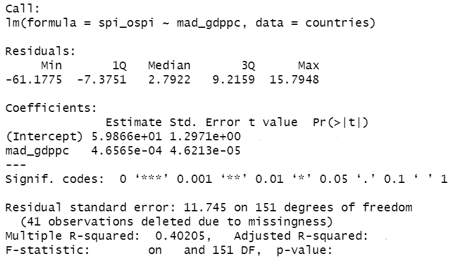

\pagestyle{fancy}
\fancyhf{}
\rhead{Will Nickols}
\lhead{Section 4}
\rfoot{Page \thepage}

# Announcements
- Make sure to sign in on the [google form (linked here)](https://forms.gle/JGvZP8CPUhaefnLT6)
- Midterm October 11

# Slope independent of outcome mean

1. Find the distribution of $\bar{Y}$.  Recall that $Y_i=\beta_0+\beta_1X_i+\epsilon_i$ with $\epsilon_i\sim\mathcal{N}(0,\sigma^2)$.

2. Show that $E(\bar{Y}\hat{\beta_1})=E(\bar{Y})E(\hat{\beta_1})$.  Recall that $$\hat{\beta_1}=\frac{\sum_{i=1}^n(X_i-\bar{X})(Y_i-\bar{Y})}{\sum_{i=1}^n(X_i-\bar{X})^2}$$
Hint: Use the fact that $\bar{Y}=\beta_0+\beta_1\bar{X}+\bar{\epsilon}$ and think about what is fixed and what is random.

3. Find the covariance of $\bar{Y}$ and $\hat{\beta_1}$.

4. Apply 7.5.7 from the Stat 110 textbook to show that $\bar{Y}$ and $\hat{\beta_1}$ are independent.

# Redundant summary information

Here's a bunch of useful information ([also available here](http://facweb.cs.depaul.edu/sjost/csc423/documents/f-test-reg.htm), but be careful of what they call $p$):

Definitions:

- Sum of squares model (SSM): $\sum_{i=1}^n(\hat{Y_i}-\bar{Y})^2$
- Sum of squares error (SSE): $\sum_{i=1}^n(Y_i-\hat{Y_i})^2$
- Sum of squares total (SST): $\sum_{i=1}^n(Y_i-\bar{Y})^2$
- Degrees of freedom for model with $p$ predictors and an intercept ($\textrm{df}_M$): $p$
- Degrees of freedom for error with $p$ predictors and an intercept ($\textrm{df}_E$): $n-p-1$
- Residual standard error: $\sqrt{\textrm{SSE}/\textrm{df}_E}$
- $R^2$: $1-\textrm{SSE}/\textrm{SST}$
- Adjusted $R^2$: $1-(1-R^2)\frac{n-1}{\textrm{df}_E}$

Facts:

- $\textrm{SSE} + \textrm{SSM} = \textrm{SST}$
- $\hat{\sigma}^2=\textrm{SSE}/\textrm{df}_E$
- Under the null (all coefficients are 0),
$$\frac{\textrm{SSM}/\textrm{df}_M}{\textrm{SSE}/\textrm{df}_E}\sim F_{\textrm{df}_M, \textrm{df}_E}$$

{height=3in}

From the partial output above, calculate the following:

1. How many non-NA data points were included.

2. The $t$-statistics for the intercept and `mad_gdppc` coefficient.

3. The p-values of the two $t$-tests for the intercept and `mad_gdppc` coefficient being 0.

```{r}
# TODO: intercept

# TODO: mad_gdppc coefficient
```

4. A 95\% confidence interval for the `mad_gdppc` coefficient.

```{r}
# TODO: CI
```

5. The adjusted $R^2$.

6. The sum of squares error, the sum of squares total, and the sum of squares model.

7. The $f$-statistic and p-value for the test that all coefficients are equal to 0.

```{r}
# TODO: f statistic
```

8. Note that the hypothesis tested in 7 ($H_0:\beta_1=0$ vs $H_a:\beta_1\neq0$) was the same as one of the hypotheses tested in 2.  If our framework is consistent, these should give the same answer.  Recall from week 2's section that if $T_n\sim t_n$, $T_n^2\sim F_{1,n}$.  Show (numerically) that your calculated $t$ statistic squared is your $f$ statistic, and explain how this shows that the two tests are the same.  (Note that this only works because we have a single predictor.)

# Regression on real data

This section will deal with a data set of country-level statistics from [this source](https://www.gu.se/en/quality-government/qog-data/data-downloads/standard-dataset) with an explanation of the data encoding found [here](https://www.qogdata.pol.gu.se/data/codebook_std_jan22.pdf).

```{r}
countries <- read.csv("data/countries.csv")
```

1. Fit a linear model to predict the percent of individuals using the internet in a country (`wdi_internet`) from the log of its GDP per capita (`mad_gdppc`), and formally test whether this association is significant.  Provide a visual to support your conclusion.

```{r}
library(ggplot2)

# TODO: Make linear model

# TODO: Make a plot
```

2. Check the assumptions of the model.

```{r, fig.height=6}
# TODO: Visualize assumptions
```

- Linearity:
- Constant variance: 
- Normality:
- Independence:

3. Uganda has a GDP per capita listed but no statistic for internet access.  Provide a point estimate and 90\% prediction interval.

```{r}
# TODO: Provide prediction
```

# How bad are correlated residuals?

Let $Y_i=\beta_0+\beta_1X_i+\epsilon_i$ with marginal $\epsilon_i\sim\mathcal{N}(0, 1)$ and $\textrm{Corr}(\epsilon_i,\epsilon_{i+1})=\rho$ for $i\in\{1, ..., n-1\}$ and $\textrm{Corr}(\epsilon_i,\epsilon_{i-1})=\rho$ for $i\in\{2, ..., n\}$ and $\textrm{Corr}(\epsilon_i,\epsilon_{j})=0$ otherwise.  Write a function to use simulation to find the probability of rejecting the null $H_0:\beta_1=0$, the expected value $E(\hat{\beta_1})$, and the standard deviation $\textrm{SD}(\hat{\beta_1})$ in the following situations:

```{r}
library(MASS)

nsims = 1000
n = 10
b0 = 1

run_sim = function(nsims, n, p, b0, b1, sorted=FALSE) {
  # Covariance matrix
  Sigma = matrix(0, nrow = n, ncol = n)
  diag(Sigma) <- 1
  for (i in 2:n) {
    Sigma[i, i-1] <- p
    Sigma[i-1, i] <- p
  }
  
  pval = vector(length = nsims)
  coef = vector(length = nsims)
  
  for (i in 1:nsims) {
    # Generate x
    if (sorted) {
      x <- sort(rgamma(n, 3, 2/5))
    } else {
      x <- rgamma(n, 3, 2/5)
    }
    # Generate y with multivariate normal
    y <- b0 + b1 * x + mvrnorm(n = 1, rep(0, n), Sigma)
    
    # TODO: Get p-value and coefficient
  }
  
  # TODO: Return probability of rejecting the null, mean, sd
  return()
}

```

1. $n=10$, $X_i\sim\textrm{Gamma}(3, 2/5)$, $\rho=0$, $\beta_0=1$, $\beta_1=1$.

```{r}
run_sim(nsims, n, 0, b0, 1, sorted=FALSE)
```

2. $n=10$, $X_i\sim\textrm{Gamma}(3, 2/5)$, $\rho=0.5$, $\beta_0=1$, $\beta_1=1$.

```{r}
run_sim(nsims, n, 0.5, b0, 1, sorted=FALSE)
```

3. $n=10$, $X_i\sim\textrm{Gamma}(3, 2/5)$ sorted, $\rho=0$, $\beta_0=1$, $\beta_1=1$.

```{r}
run_sim(nsims, n, 0, b0, 1, sorted=TRUE)
```

4. $n=10$, $X_i\sim\textrm{Gamma}(3, 2/5)$ sorted, $\rho=0.5$, $\beta_0=1$, $\beta_1=1$.

```{r}
run_sim(nsims, n, 0.5, b0, 1, sorted=TRUE)
```

5. $n=10$, $X_i\sim\textrm{Gamma}(3, 2/5)$, $\rho=0$, $\beta_0=1$, $\beta_1=0$.

```{r}
run_sim(nsims, n, 0, b0, 0, sorted=FALSE)
```

6. $n=10$, $X_i\sim\textrm{Gamma}(3, 2/5)$, $\rho=0.5$, $\beta_0=1$, $\beta_1=0$.

```{r}
run_sim(nsims, n, 0.5, b0, 0, sorted=FALSE)
```

7. $n=10$, $X_i\sim\textrm{Gamma}(3, 2/5)$ sorted, $\rho=0$, $\beta_0=1$, $\beta_1=0$.

```{r}
run_sim(nsims, n, 0, b0, 0, sorted=TRUE)
```

8. $n=10$, $X_i\sim\textrm{Gamma}(3, 2/5)$ sorted, $\rho=0.5$, $\beta_0=1$, $\beta_1=0$.

```{r}
run_sim(nsims, n, 0.5, b0, 0, sorted=TRUE)
```

9. What conclusions can you draw?
