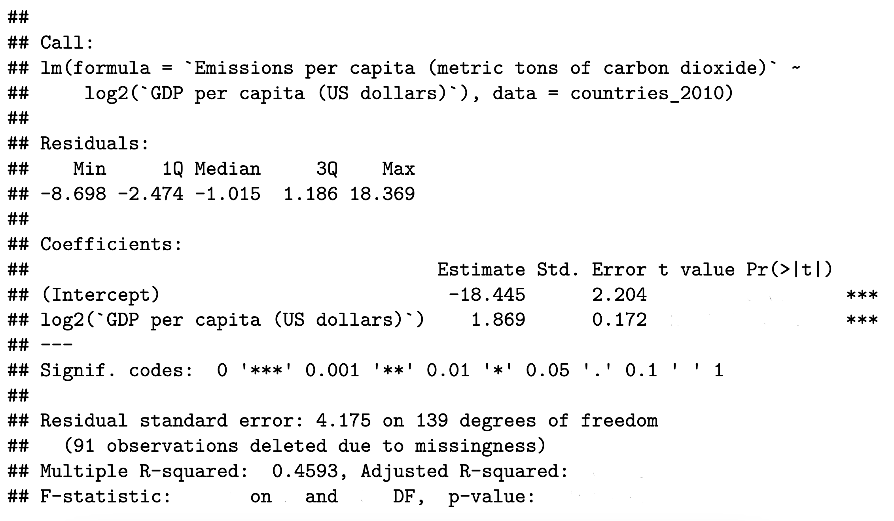

---
output:
  pdf_document: default
  html_document:
    df_print: paged
header-includes:
- \usepackage{tcolorbox}
- \usepackage{fancyhdr}
- \usepackage[utf8]{inputenc}
- \usepackage{wrapfig}
- \usepackage{amsmath}
- \usepackage{booktabs}
- \usepackage{esvect}
urlcolor: blue
---

\pagestyle{fancy}
\fancyhf{}
\rhead{Will Nickols}
\lhead{Section 4}
\rfoot{Page \thepage}

# Announcements

\begin{wrapfigure}{r}{0.12\textwidth}
  \centering
    \vspace*{-1.3cm}
    \includegraphics[width=\linewidth]{section_qr_code.png}
\end{wrapfigure}

Make sure to sign in on the [google form](https://forms.gle/xm1DfzuZFNcWU6fH8) (I send a list of which section questions are useful for which pset questions afterwards)

Pset 3 due Friday 10/6

# Introductions
- One question or thought related to lecture last week (Inference, linear model assumptions, and intro to multiple regression)

# Filling in the lm table

Here's some useful information:

Definitions:

- Sum of squares model (SSM): $\sum_{i=1}^n(\hat{Y_i}-\bar{Y})^2$
- Sum of squares error (SSE): $\sum_{i=1}^n(Y_i-\hat{Y_i})^2$
- Sum of squares total (SST): $\sum_{i=1}^n(Y_i-\bar{Y})^2$
- Degrees of freedom for the model with $p$ predictors and an intercept ($\textrm{df}_M$): $p$
- Degrees of freedom for the error with $p$ predictors and an intercept ($\textrm{df}_E$): $n-p-1$
- $R^2$: $1-\textrm{SSE}/\textrm{SST}$
- Adjusted $R^2$: $1-(1-R^2)\frac{n-1}{\textrm{df}_E}$

Facts:

- $\textrm{SSE} + \textrm{SSM} = \textrm{SST}$
- $\hat{\sigma}^2=\textrm{SSE}/\textrm{df}_E$
- Under the null (all coefficients are 0),
$$\frac{\textrm{SSM}/\textrm{df}_M}{\textrm{SSE}/\textrm{df}_E}\sim F_{\textrm{df}_M, \textrm{df}_E}$$

We'll be looking at emissions per capita regressed on log GDP per capita in 2010. For context, average emissions for countries that reported them were 5.27 metric tons of carbon dioxide per person.

{height=2.6in}

```{r, include=F}
countries <- read.csv("data/country_stats.csv", check.names = F)
countries_2010 <- countries[countries$Year == 2010,]

# Show n
sum(!is.na(countries_2010$`GDP per capita (US dollars)`) & !is.na(countries_2010$`Emissions per capita (metric tons of carbon dioxide)`))

# Display model
lm1 <- summary(lm(`Emissions per capita (metric tons of carbon dioxide)` ~ log2(`GDP per capita (US dollars)`), countries_2010))
```

From the partial output above, calculate the following:

1. How many non-NA data points were included.

\vspace{1 cm}

2. The $t$-statistics for the intercept and the `log2(GDP per capita (US dollars))` coefficient.

\vspace{1.5 cm}

3. How you would find the p-values of the two $t$-tests for the intercept and the `log2(GDP per capita (US dollars))` coefficient being 0.

\vspace{2.5 cm}

4. A 95\% confidence interval for the `log2(GDP per capita (US dollars))` coefficient.

\vspace{1.5 cm}

5. The adjusted $R^2$.

\vspace{1 cm}

6. The sum of squares error, the sum of squares total, and the sum of squares model.

\vspace{2 cm}

7. The $f$-statistic and p-value for the test that all coefficients are equal to 0.

\vspace{2.5 cm}

8. Note that the hypothesis tested in 7 ($H_0:\beta_1=0$ vs $H_a:\beta_1\neq0$) was the same as one of the hypotheses tested in 2. If our framework is consistent, these should give the same answer. Recall from week 2's section that if $T_n\sim t_n$, $T_n^2\sim F_{1,n}$. Show (numerically) that your calculated $t$ statistic squared is your $f$ statistic, and explain how this shows that the two tests are the same. (Note that this only works because we have a single predictor.)

\vspace{2 cm}

\newpage

# Intuitive F test

Performing an overall $F$ test with the sum of squares as above makes sense when deriving the $F$ test, but the sum of squares involved are cumbersome and unintuitive. Here, we'll create a more intuitive test statistic.

1. Write $\textrm{SSE}$ and $\textrm{SSM}$ in terms of $\hat{\sigma}^2$, $\textrm{df}_E$, and $R^2$.

\vspace{3 cm}

2. Use these to write the $F$-statistic only in terms of $R^2$, $\textrm{df}_E$, and $\textrm{df}_M$.

\vspace{2 cm}

3. Use this to explain how a higher or lower $R^2$, $\textrm{df}_E$, and $\textrm{df}_M$ contribute to a more or less significant $F$ test. Why do these make sense?

\vspace{5 cm}

\newpage

# Regression on real data

These problems will deal with a dataset of country-level statistics from [UNdata](https://data.un.org/) and [Varieties of Democracy](https://v-dem.net/data/the-v-dem-dataset/).

1. Using this linear model regressing log emissions per capita on log energy per capita and the log of the number of tourists, interpret the results:

```{r, echo=F}
lm1 <- lm(log2(`Emissions per capita (metric tons of carbon dioxide)`) ~ log2(`Supply per capita (gigajoules)`) + 
            log2(`Tourist/visitor arrivals (thousands)`), 
          countries_2010[countries_2010$`Emissions per capita (metric tons of carbon dioxide)` > 0,])

summary(lm1)
```

\vspace{2 cm}

2. Check the assumptions of the model.

```{r, echo=F, fig.width=7.5, fig.height=7, fig.align='center', cache=T, warning=F}
par(mfrow=c(2,2))
plot(lm1)
```

\vspace{3 cm}

3. Uganda has tourism and energy usage data but no emissions data. The following are a 90\% confidence interval and a 90\% prediction interval for Uganda's log emissions from this data. Identify which is which, and interpret them.

```{r, echo=F}
round(predict(lm1, newdata=countries_2010[countries_2010$Country=="Uganda",], 
        interval = c("confidence"), level = 0.90), 3)
round(predict(lm1, newdata=countries_2010[countries_2010$Country=="Uganda",], 
        interval = c("prediction"), level = 0.90), 3)
```

\vspace{2 cm}

4. What we actually care about is Uganda's emissions, not its log emissions. We can exponentiate one of the intervals above to get a valid interval on the original scale, but exponentiating the other would not be valid. Which is which and why?

\vspace{3 cm}
