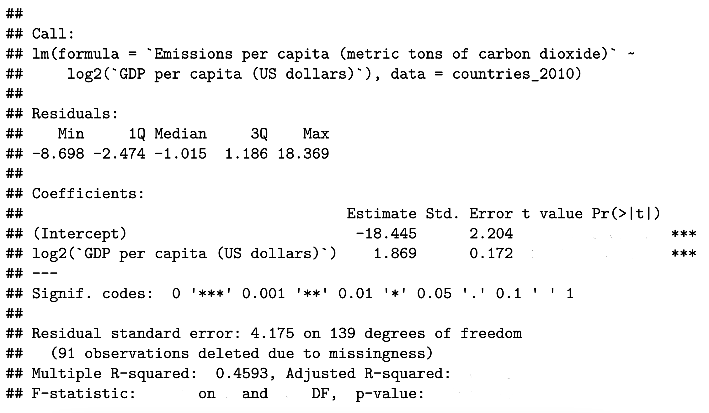

---
output:
  pdf_document: default
  html_document:
    df_print: paged
header-includes:
- \usepackage{tcolorbox}
- \usepackage{fancyhdr}
- \usepackage[utf8]{inputenc}
- \usepackage{wrapfig}
- \usepackage{amsmath}
- \usepackage{booktabs}
- \usepackage{esvect}
urlcolor: blue
---

\pagestyle{fancy}
\fancyhf{}
\rhead{Will Nickols}
\lhead{Section 4}
\rfoot{Page \thepage}

# Announcements

\begin{wrapfigure}{r}{0.12\textwidth}
  \centering
    \vspace*{-1.3cm}
    \includegraphics[width=\linewidth]{section_qr_code.png}
\end{wrapfigure}

Make sure to sign in on the [google form](https://forms.gle/xm1DfzuZFNcWU6fH8) (I send a list of which section questions are useful for which pset questions afterwards)

Pset 3 due Friday 10/6

# Introductions
- Names
- One question or thought related to lecture last week (Correlation, simple regression, inference)

```{r, echo=F, warning=F, message=F, cache=F}
list.of.packages <- c("ggplot2", "gridExtra")
new.packages <- list.of.packages[!(list.of.packages %in% installed.packages()[,"Package"])]
if(length(new.packages)) install.packages(new.packages)

library(ggplot2)
library(gridExtra)
```

# Slope independent of outcome mean

In this problem, we'll show that the slope in a linear regression ($\hat{\beta}_1$) is independent of the mean outcome ($\bar{Y}$). Suppose we have pairs $(X_i,Y_i)$ for $i\in\{1,...,n\}$.

1. Recall that in a simple linear regression we assume $Y_i=\beta_0+\beta_1 X_i + \epsilon_i$ with $X_i$ known and $\epsilon_i\sim\mathcal{N}(0,\sigma^2)$. The vector $(\bar{Y}, Y_1-\bar{Y}, Y_2-\bar{Y}, ..., Y_n-\bar{Y})^T$ has a multivariate Normal distribution. Find the covariance of $\bar{Y}$ and $Y_i-\bar{Y}$.

$$\begin{aligned}\textrm{Cov}(\bar{Y},Y_i-\bar{Y})&=\textrm{Cov}(\bar{Y},Y_i)-\textrm{Cov}(\bar{Y}, \bar{Y})\\
&=\textrm{Cov}(Y_i/n,Y_i)-\textrm{Var}(\bar{Y})\\
&=\frac{1}{n}\textrm{Var}(Y_i)-\textrm{Var}\left(\frac{1}{n}\sum_{i=1}^n \beta_0-\beta_1X_i+\epsilon_i\right)\\
&=\frac{\sigma^2}{n}-\frac{1}{n^2}\sum_{i=1}^n \textrm{Var}(\epsilon_i)\\
&=0
\end{aligned}$$

2. What does this imply about $\bar{Y}$ and all the $Y_i-\bar{Y}$?

$\bar{Y}$ is independent of all the $Y_i-\bar{Y}$ since uncorrelated implies independent in a multivarite Normal distribution.

3. What does this say about the relationship between $\bar{Y}$ and $\hat{\beta}_1$? Recall that $$\hat{\beta_1}=\frac{\sum_{i=1}^n(X_i-\bar{X})(Y_i-\bar{Y})}{\sum_{i=1}^n(X_i-\bar{X})^2}$$

$\hat{\beta}_1$ is just a function of the $(Y_i-\bar{Y})$s, so it is also independent of $\bar{Y}$.

\newpage

# Rule of thumb

Suppose we have $n$ pairs of $(X_i, Y_i)$ and we regress $Y$ on $X$ to get a slope $\hat{\beta}_1$ and $X$ on $Y$ to get a slope $\hat{\beta}_1'$. At first glance, it might seem like the $\hat{\beta}_1=1/\hat{\beta}_1'$. However, as you can see in the plots below, this is wrong.

```{r, echo=F, fig.width=6, fig.height=3, fig.align='center', cache=T, warning=F}
set.seed(139)
n <- 500
beta_0 <- 2
beta_1 <- 0.5
x <- rnorm(n, 10, 5)
y <- beta_0 + beta_1 * x + rnorm(n, 0, 3)
lm1 <- summary(lm(y ~ x))
plot1 <- ggplot(data.frame(x, y), aes(x=x, y=y)) + 
  geom_point() + 
  geom_smooth(method = 'lm', formula = 'y ~ x') + 
  theme_bw() + 
  annotate(
    "text", label = paste0("Slope: ", round(lm1$coefficients[2,1], 3), "\nR2: ", round(lm1$r.squared, 3)),
    x = -2, y = 25, size = 4, colour = "red"
  ) + 
  coord_equal() + 
  xlim(-8, 28) + 
  ylim(-8, 28)

lm2 <- summary(lm(x ~ y))
plot2 <- ggplot(data.frame(x, y), aes(x=y, y=x)) + 
  geom_point() + 
  geom_smooth(method = 'lm', formula = 'y ~ x') + 
  theme_bw() + 
  xlab("y") + 
  ylab("x") +
  annotate(
    "text", label = paste0("Slope: ", round(lm2$coefficients[2,1], 3), "\nR2: ", round(lm2$r.squared, 3)),
    x = -2, y = 25, size = 4, colour = "red"
  ) + 
  coord_equal() + 
  xlim(-8, 28) + 
  ylim(-8, 28)

grid.arrange(plot1, plot2, ncol=2)
```

1. Why is this wrong?

Because we are only trying to minimize the vertical residuals, we end up with non-reciprocal slopes. You can imagine a case where $X$ and $Y$ are independent, so both slopes would be 0, but clearly these are not reciprocals. This can also be viewed as a case of regression to the mean in which an extreme $X$ value predicts a $Y$ value that's not quite as extreme.

2. In the rest of the problem, we'll try to find the proper relationship between the two slopes. Recall that when regressing $Y$ on $X$, we have
$$R^2=1-\frac{\sum_{i=1}^n(Y_i-\hat{Y_i})^2}{\sum_{i=1}^n(Y_i-\bar{Y})^2}$$
Consider our simple regression with the estimators $$\hat{\beta}_1=\frac{\sum_{i=1}^n(Y_i-\bar{Y})(X_i-\bar{X})}{\sum_{i=1}^n(X_i-\bar{X})^2}, \;\;\;\hat{\beta}_{0}=\bar{Y}-\hat{\beta}_{1}\bar{X}$$
and consider the flipped regression estimators $$\hat{\beta}_{1}'=\frac{\sum_{i=1}^n(Y_i-\bar{Y})(X_i-\bar{X})}{\sum_{i=1}^n(Y_i-\bar{Y})^2}, \;\;\;\hat{\beta}_{0}'=\bar{X}-\hat{\beta}_{1}'\bar{Y}$$ 
Find an expression for $\hat{\beta}_{1}'$ in terms of $\hat{\beta}_{1}$.

$$\hat{\beta}_{1}'=\hat{\beta}_{1}\frac{\sum_{i=1}^n(X_i-\bar{X})^2}{\sum_{i=1}^n(Y_i-\bar{Y})^2}$$

3. Solve for $R^2$ in terms of $\hat{\beta}_1$ and $\frac{\sum_{i=1}^n(X_i-\bar{X})^2}{\sum_{i=1}^n(Y_i-\bar{Y})^2}$. You may use the fact that $$\sum_{i=1}^n(Y_i-\bar{Y})^2=\sum_{i=1}^n(Y_i-\hat{Y_i})^2+\sum_{i=1}^n(\hat{Y_i}-\bar{Y})^2$$ (See my [Stat 111 section 6 notes](https://github.com/WillNickols/Stat111/blob/main/Section%206/Section%206%20solutions/Nickols_Section_6_Solutions.pdf) for why this is the case in simple linear regression.)

$$\begin{aligned}R^2&=1-\frac{\sum_{i=1}^n(Y_i-\hat{Y}_i)^2}{\sum_{i=1}^n(Y_i-\bar{Y})^2}\\
&=\frac{\sum_{i=1}^n(Y_i-\bar{Y})^2-\sum_{i=1}^n(Y_i-\hat{Y}_i)^2}{\sum_{i=1}^n(Y_i-\bar{Y})^2}\\
&=\frac{\sum_{i=1}^n(\hat{Y_i}-\bar{Y})^2}{\sum_{i=1}^n(Y_i-\bar{Y})^2}\\
&=\frac{\sum_{i=1}^n(\hat{\beta}_0+\hat{\beta}_1X_i-(\hat{\beta}_0+\hat{\beta}_1\bar{X}))^2}{\sum_{i=1}^n(Y_i-\bar{Y})^2}\\
&=\frac{\sum_{i=1}^n(\hat{\beta}_1X_i-\hat{\beta}_1\bar{X})^2}{\sum_{i=1}^n(Y_i-\bar{Y})^2}\\
&=\hat{\beta}_1^2\frac{\sum_{i=1}^n(X_i-\bar{X})^2}{\sum_{i=1}^n(Y_i-\bar{Y})^2}\\
\end{aligned}$$

4. Use this to write an expression for $\hat{\beta}_1'$ in terms of $R^2$ and $\hat{\beta}_1$.

$$\hat{\beta}_1'=\frac{R^2}{\hat{\beta}_1}$$
Notably, $0\leq R^2\leq 1$ for an OLS model, so $0\leq \hat{\beta}_1'\leq 1/\hat{\beta}_1$. Not only does this give us the relation between the slopes, it does so in a way that uses the two most commonly reported statistics about the model: the estimated slope and the $R^2$!

\newpage

# Real data linear model

These problems will deal with a dataset of country-level statistics from [UNdata](https://data.un.org/) and [Varieties of Democracy](https://v-dem.net/data/the-v-dem-dataset/).

```{r, echo=F}
# Read in the data
countries <- read.csv("data/country_stats.csv", check.names = F)
```

1. Suppose we want to know the relationship between log 2010 GDP per capita and the 2010 life expectancy for females at birth. Formally test the association using the following output:
```{r, echo=F}
countries_2010 <- countries[countries$Year == 2010,]
summary(lm(`Life expectancy at birth for females (years)` ~ log2(`GDP per capita (US dollars)`), countries_2010))
```
We are interested in testing $H_0:\beta_1=0$ vs $H_a:\beta_1\neq0$ where $\beta_1$ is the slope relating log2 GDP per capita to female life expectancy. We get a $t$-statistic of $19.11$ and a p-value less than $2\times 10^{-16}$ which indicates that there is a significant relationship between log GDP per capita and female life expectancy. In particular, a change in log2 GDP per capita of 1 (a doubling of GDP per capita) corresponds to an extra 3.35 years of life expected at birth.

2. Suppose we read this result in a paper but what we actually cared about was the regression of log2 GDP per capita on female life expectancy at birth. What can we conclude about this alternative regression?

Using the result we derived above, our slope would be $R^2/\hat{\beta}_1=0.6382/3.3499=0.1905$, so an increase in female life expectancy at birth of 1 year is associated with a 0.19 increase in log2 GDP per capita (1.14x multiplicative increase).

\newpage

# Filling in the lm table

Here's some useful information:

Definitions:

- Sum of squares model (SSM): $\sum_{i=1}^n(\hat{Y_i}-\bar{Y})^2$
- Sum of squares error (SSE): $\sum_{i=1}^n(Y_i-\hat{Y_i})^2$
- Sum of squares total (SST): $\sum_{i=1}^n(Y_i-\bar{Y})^2$
- Degrees of freedom for the model with $p$ predictors and an intercept ($\textrm{df}_M$): $p$
- Degrees of freedom for the error with $p$ predictors and an intercept ($\textrm{df}_E$): $n-p-1$
- $R^2$: $1-\textrm{SSE}/\textrm{SST}$
- Adjusted $R^2$: $1-(1-R^2)\frac{n-1}{\textrm{df}_E}$

Facts:

- $\textrm{SSE} + \textrm{SSM} = \textrm{SST}$
- $\hat{\sigma}^2=\textrm{SSE}/\textrm{df}_E$
- Under the null (all coefficients are 0),
$$\frac{\textrm{SSM}/\textrm{df}_M}{\textrm{SSE}/\textrm{df}_E}\sim F_{\textrm{df}_M, \textrm{df}_E}$$

We'll be looking at emissions per capita regressed on log GDP per capita in 2010. For context, average emissions for countries that reported them were 5.27 metric tons of carbon dioxide per person.

{height=2.6in}

```{r, include=F}
countries <- read.csv("data/country_stats.csv", check.names = F)
countries_2010 <- countries[countries$Year == 2010,]

# Show n
sum(!is.na(countries_2010$`GDP per capita (US dollars)`) & !is.na(countries_2010$`Emissions per capita (metric tons of carbon dioxide)`))

# Display model
lm1 <- summary(lm(`Emissions per capita (metric tons of carbon dioxide)` ~ log2(`GDP per capita (US dollars)`), countries_2010))
```

From the partial output above, calculate the following:

1. How many non-NA data points were included.

$n = \textrm{df}_E + p + 1 = \textrm{df}_E + 1 + 1 = 141$

2. The $t$-statistics for the intercept and the `log2(GDP per capita (US dollars))` coefficient.

$$\begin{aligned}t = \frac{\textrm{Estimate}}{\textrm{Standard error}}\implies t_{\beta_0}&=-18.445/2.204=-8.37\\
t_{\beta_1}&=1.869/0.172=10.87\end{aligned}$$

3. How you would find the p-values of the two $t$-tests for the intercept and the `log2(GDP per capita (US dollars))` coefficient being 0.

We want the mass that is beyond the $t$-statistic in the $t_{\textrm{df}_E}$ distribution:

$$\begin{aligned}p_{\beta_0}&=2\cdot(1-F_{t_{139}}(|t_{\beta_0}|))=5.5\times 10^{-14}\\
p_{\beta_1}&=2\cdot(1-F_{t_{139}}(|t_{\beta_1}|))=2.7\times 10^{-20}\\
\end{aligned}$$

where $F_{t_{139}}$ is the $t_{139}$ CDF.

```{r, include=F}
# Intercept
2 * pt(abs(lm1$coefficients[1,3]), df = 139, lower.tail = F)

# log GDP per capita coefficient
2 * pt(lm1$coefficients[2,3], df = 139, lower.tail = F)
```

4. A 95\% confidence interval for the `log2(GDP per capita (US dollars))` coefficient.

Letting $t^*$ be the $0.975$ quantile of the $t_{139}$ distribution,
$$\hat{\beta_1}\pm t^*\cdot\textrm{SE}_{\hat{\beta}_1}=1.869\pm 1.977\cdot 0.172=(1.53, 2.21)$$ which doesn't include 0 as expected.

```{r, include=F}
qt(0.975, 139)
```

5. The adjusted $R^2$.

$$1-(1-R^2)\frac{n-1}{\textrm{df}_E}=1-(1-0.4593)\frac{140}{139}=0.4554$$

6. The sum of squares error, the sum of squares total, and the sum of squares model.

$$\textrm{SSE}=\textrm{Residual standard error}^2\cdot \textrm{df}_E = 4.175^2\cdot 139=2422.857$$
$$\textrm{SST}=\frac{\textrm{SSE}}{1-R^2}=2422.857/0.5407=4480.964$$
$$\textrm{SSM}=\textrm{SST}-\textrm{SSE}=2058.107$$

7. The $f$-statistic and p-value for the test that all coefficients are equal to 0.

$$\begin{aligned}f_{\textrm{Overall}}&=\frac{\textrm{SSM}/\textrm{df}_M}{\textrm{SSE}/\textrm{df}_E}=\frac{2058.107/1}{2422.857/139}=118.1\\
p_{\textrm{Overall}}&=1-F_{1,139}(f_{\textrm{Overall}})=2.7\times 10^{-20}
\end{aligned}$$

```{r, include=F}
pf(lm1$fstatistic[1], 1, 139, lower.tail = F)
```

8. Note that the hypothesis tested in 7 ($H_0:\beta_1=0$ vs $H_a:\beta_1\neq0$) was the same as one of the hypotheses tested in 2. If our framework is consistent, these should give the same answer. Recall from week 2's section that if $T_n\sim t_n$, $T_n^2\sim F_{1,n}$. Show (numerically) that your calculated $t$ statistic squared is your $f$ statistic, and explain how this shows that the two tests are the same. (Note that this only works because we have a single predictor.)

The two test statistics are within rounding error of each other: $t^2=10.87^2=118.2 \approx 118.1=f$. Under the null, a $t$-statistic $T_n$ of $\beta_1$ has a $t_n$ distribution, so $T_n^2$ will have an $F_{1,n}$ distribution. Therefore, with the observed $t$-statistic $t_n$ and $f=t_n^2$, 
$$P(|t_n|\geq |T_n|)=P(t_n^2\geq T_n^2)=P(t_n^2\geq F_{1,n})=P(f\geq F_{1,n})$$
where the first and last probabilities give our two p-values.

The full linear model for the image is here:
```{r, echo=F, cache=T}
# Show n
# sum(!is.na(countries_2010$`GDP per capita (US dollars)`) & !is.na(countries_2010$`Emissions per capita (metric tons of carbon dioxide)`))

# Display model
summary(lm(`Emissions per capita (metric tons of carbon dioxide)` ~ log2(`GDP per capita (US dollars)`), countries_2010))
```

\newpage

# Intuitive F test

Performing an overall $F$ test with the sum of squares as above makes sense when deriving the $F$ test, but the sum of squares involved are cumbersome and unintuitive. Here, we'll create a more intuitive test statistic.

1. Write $\textrm{SSE}$ and $\textrm{SSM}$ in terms of $\hat{\sigma}^2$, $\textrm{df}_E$, and $R^2$.

$$\begin{aligned}\textrm{SSE}&=\hat{\sigma}^2\cdot \textrm{df}_E\\
\textrm{SST}&=\frac{\textrm{SSE}}{1-R^2}\implies\textrm{SSM}=\textrm{SST}-\textrm{SSE}=\textrm{SSE}\left(\frac{1}{1-R^2}-1\right)=\hat{\sigma}^2\cdot \textrm{df}_E\cdot\frac{R^2}{1-R^2}
\end{aligned}$$

2. Use these to write the $F$-statistic only in terms of $R^2$, $\textrm{df}_E$, and $\textrm{df}_M$.

$$F=\frac{\textrm{SSM}/\textrm{df}_M}{\textrm{SSE}/\textrm{df}_E}=\frac{R^2}{1-R^2}\cdot\frac{\textrm{df}_E}{\textrm{df}_M}$$

3. Use this to explain how a higher or lower $R^2$, $\textrm{df}_E$, and $\textrm{df}_M$ contribute to a more or less significant $F$ test. Why do these make sense?

- Holding $\textrm{df}_E$ and $\textrm{df}_M$ equal, an $R^2$ closer to 1 gives a larger $F$-statistic, which makes sense because the model is explaining more of the variability, so we expect the coefficients to be non-zero.
- When $\textrm{df}_E$ is higher (holding the other two equal), the $F$ statistic increases. When the $R^2$ is the same and $\textrm{df}_E$ is higher, the model is explaining more data points with the same number of predictors, giving us confidence that the coefficients are non-zero.
- When $\textrm{df}_M$ is higher (holding the other two equal), we're using more predictors to get the same explanatory power ($R^2$), so we expect that these coefficients are not that useful. This drives down the $F$-statistic, giving us a less significant result.

